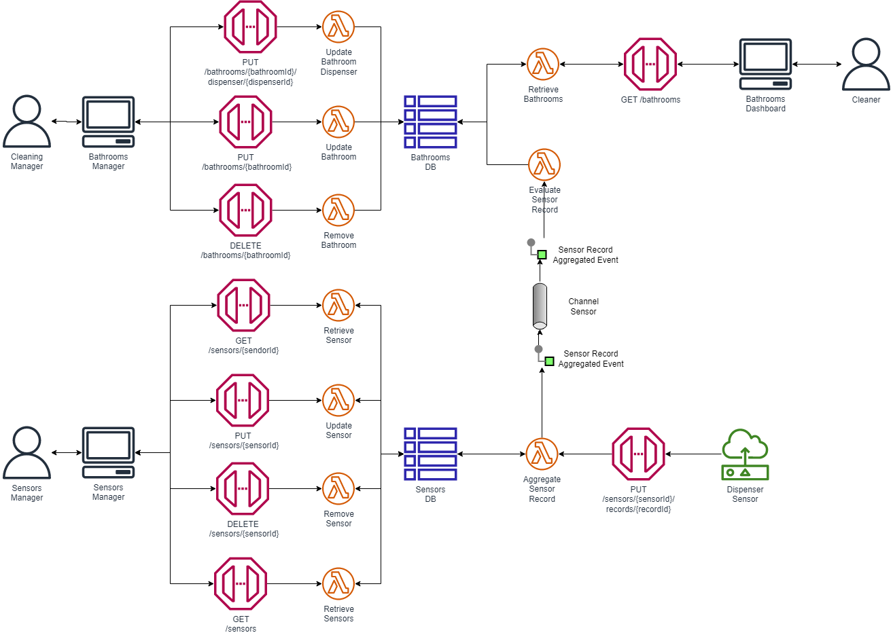

# Bathroom Monitoring
Application for monitoring the status of toilet paper in restrooms.

Typescript implementation using hexagonal architecture.

## Architecture
 

## How to Deploy
### Configure
```bash
aws configure
```

### Transpile
```bash
yarn build
```

### Build
```bash
sam build
```

### Deploy
```bash
sam deploy --guided
```

## How to Simulate
```bash
export API_URL=<api-url>
```

```bash
 python3 src/apps/simulator/multi.py
```
